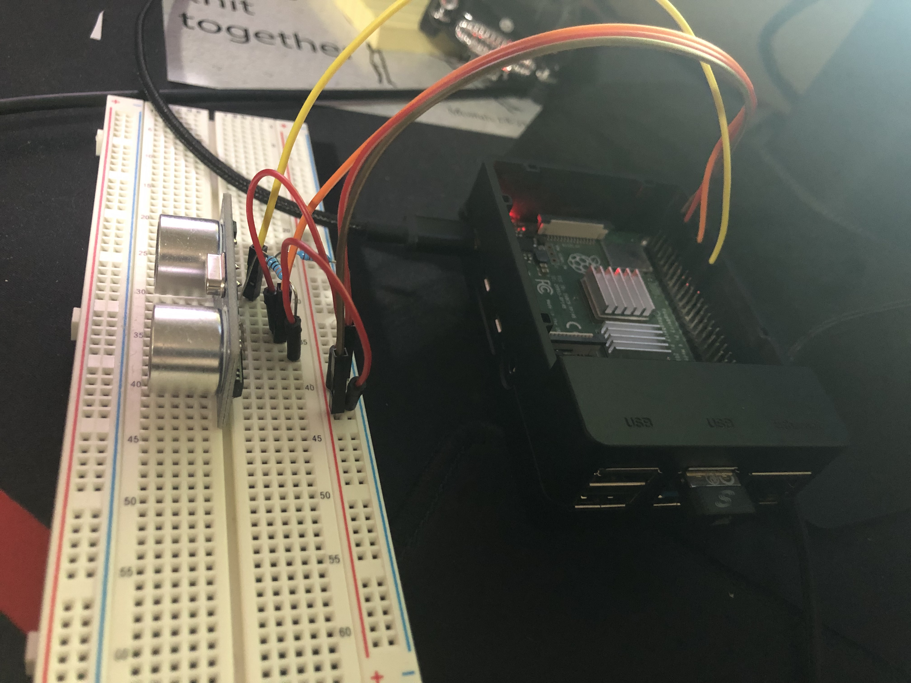
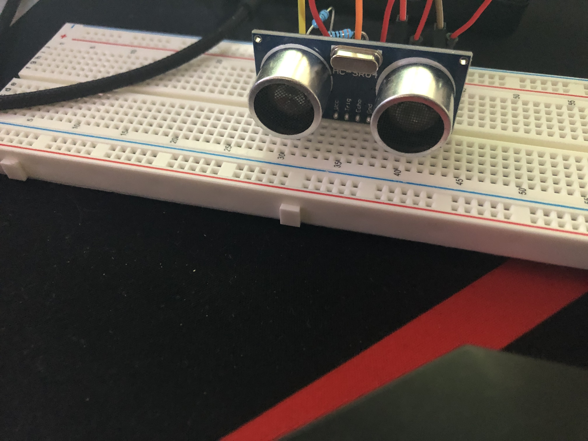

# Intruder Alert #
With the holidays coming up, I felt that my home security needed to be a little bit more than just a lock on my door. In order to do that I grabbed my raspberry pi 4 and a couple items one of my arduino kits and started to play with the ultrasonic sensor.
## Overview ##
This project is a way for you to detect an intruder using the ultrasonic sensor from arduino and a raspberry pi (with internet capabilities). The code will check for a certain distance and if that distance is less than what you expect it will send you an email based on the credentials you provide in the code. This project uses googles smtp server so it will only work with gmail accounts but Im sure if you wanted you could use a different smtp server.
## Items ##
For this project you will need:
- raspberry with internet capabilities
- 4 jumper wires (female to male)
- 2 to 4 jumper wires (male to male)
- an ultrasonic sensor like [this](https://tutorials-raspberrypi.com/wp-content/uploads/2014/05/bb.jpg)
- a bread board  
## Tutorials/Info ##
The setting up of the I/O pins on the raspberry pi is probably the hardest part since you will need a couple jumper wires and resistors. If you already have those, I followed this tutorial on https://tutorials-raspberrypi.com/raspberry-pi-ultrasonic-sensor-hc-sr04/ to get the pins setup. The code included in [intruder.py](Projects/Intruder/intruder.py) has sufficient comments to help you understand whats going on and how to modify it to your specific needs. If you need help setting up the email service [this](https://realpython.com/python-send-email/) is a great article that explains how it all works.
## Photos ##

  

  

